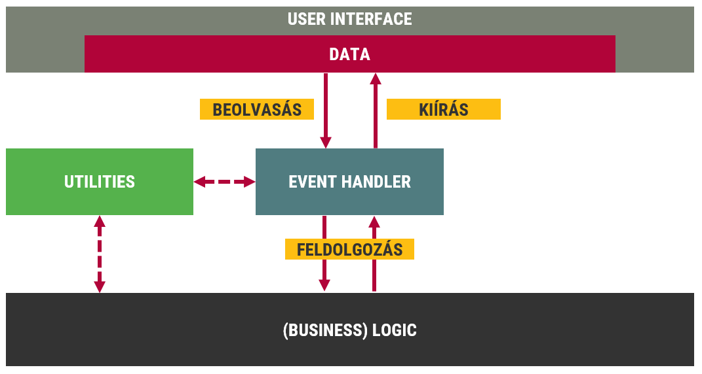
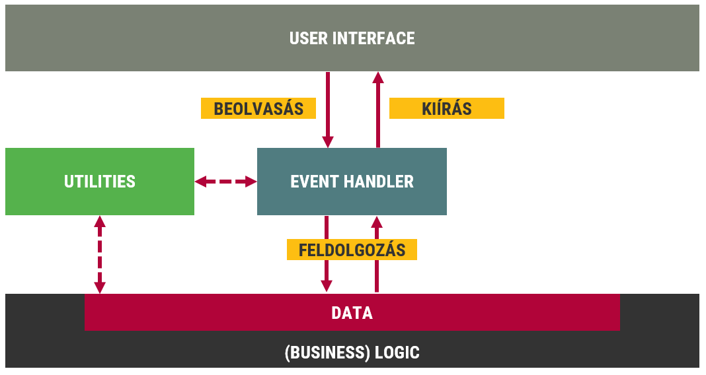
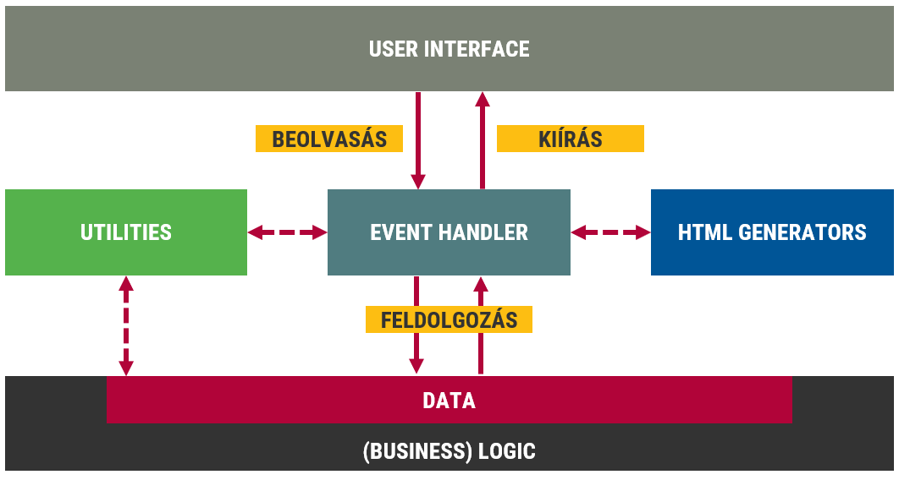

::: title
Webprogramozás
:::

### Adattárolás, időzítők

:::::: {.columns}
::: {.column width="33%"}
<small>
**Visnovitz Márton**  
egyetemi tanársegéd  
visnovitz.marton@inf.elte.hu
</small>
:::
::: {.column width="33%"}
<small>
**Gerely Viktor**  
demonstrátor  
mohmas@inf.elte.hu
</small>
:::
::: {.column width="33%"}
<small>
**Horváth Győző**  
egyetemi docens  
horvath.gyozo@inf.elte.hu
</small>
:::
::::::

<small>
1117 Budapest, Pázmány Péter sétány 1/c., 2.408  
Tel: (1) 372-2500/8469\
</small>

------

## Ismétlés {data-state="new-section"}

------

## Ismétlés

- [x] JavaScript nyelvi elemei
- [x] DOM programozás
- [x] Eseménykezelés részletei
- [x] JavaScript beépített objektumai


------

## Ismétlés -- Kódszervezés

- [x] fizikai, logikai csoportosítás
  - fájl, modul, függvény, osztály
- [x] egységbe zárás
  - objektum, osztály, függvény, modul

------

## Kódszervezés {data-state="new-section"}

Adattárolás

------

## Példa: Todo lista

<div class="example">
  <input id="newItem">
  <button id="addItem">Add</button>
  <br>
  <ul id="todoList"></ul>
</div>

<script>
  const todoList = document.querySelector("#todoList");
  const button = document.querySelector("#addItem");
  const input = document.querySelector("#newItem");

  function handleButtonClick() {
    const newItem = input.value;
    todoList.innerHTML += `<li>${newItem}</li>`;
  }

  button.addEventListener("click", handleButtonClick);
</script>

------

## Tárolás a DOM-ban (1)

```html
<input id="newItem">
<button id="addItem">Add</button>
<br>
<ul id="todoList"></ul>
```

```js
function handleButtonClick() {
  const newItem = input.value;
  todoList.innerHTML += `<li>${newItem}</li>`;
}

button.addEventListener("click", handleButtonClick);
```

------

## Tárolás a DOM-ban (1)

```html
<input id="newItem">
<button id="addItem">Add</button>
<br>
<ul id="todoList">✒>
  <li>Buy milk</li>
  <li>Learn JavaScript</li>
<✒</ul>
```

------

## Tárolás a DOM-ban (2)

```html
<input id="newItem">
<button id="addItem">Add</button>
<br >
<ul id="todoList"></ul>
```
```js
function handleButtonClick() {
  const newItem = input.value;
  const newListItem = document.createElement("li");
  newListItem.innerHTML = newItem;
  todoList.appendChild(newListItem);
}

button.addEventListener("click", handleButtonClick);
```

------

## Tárolás a DOM-ban (2)

```html
<input id="newItem">
<button id="addItem">Add</button>
<br>
<ul id="todoList"></ul>
```

```js
function handleButtonClick() {
  const newItem = input.value;
  todoList.innerHTML += `<li>${newItem}</li>`;
}

button.addEventListener("click", handleButtonClick);
```

------

## Tárolás a DOM-ban (3)

Todo lista elemei

```js
const input = document.querySelector("input");
const button = document.querySelector("button");
const listElement = document.querySelector("ul");
const listItems = document.querySelectorAll("li");

function handleButtonClick() {
    // Input
    const newItem = input.value;
    ✒>const listContent = Array.from(list).map(li => li.innerText);<✒
    // Process
    listContent.push(newItem);
    // Output
    ✒>const newElement = document.createElement("li");<✒
    newElement.innerHTML = newItem;
    ✒>listElement.appendChild(newElement);<✒
}

button.addEventListener("click", handleButtonClick);
```

------

## Tárolás a DOM-ban



------

## Tárolás a DOM-ban (összefoglalás)

- Az adatot a DOM-ban tároljuk
- Mindig onnan kell kiolvasni
- Nem alap nyelvi elem
- Adat és feldolgozó függvény szétválik
- Probléma: egységbe zárás, tárolás

------

## Adat és megjelenés szétválasztása

- Alapelv az alkalmazásfejlesztésben
- Könnyebb egységbe zárás
- Alapvető nyelvi elemeket használ
- A DOM (I/O) lassú

------

## Adat és megjelenés szétválasztása



------

## Adat és megjelenés szétválasztása

```js
✒>const list = [];<✒

const input = document.querySelector("input");
const button = document.querySelector("button");
const listElement = document.querySelector("ul");

function handleButtonClick() {
    // Input
    const newItem = input.value;
    // Process
    list.push(newItem);
    // Output
    const newElement = document.createElement("li");
    newElement.innerHTML = newItem;
    listElement.appendChild(newElement);
}

button.addEventListener("click", handleButtonClick);
```

------

## A felület mint az adat leképezése

```js
const list = [];

✒>function renderList(list) {
  return list.map(item => `<li>${item}</li>`).join("");
}<✒

{...}

function handleButtonClick() {
    // Input
    const newItem = input.value;
    // Process
    list.push(newItem);
    // Output
    ✒>listElement.innerHTML = renderList(list);<✒
}

button.addEventListener("click", handleButtonClick);
```

------

## Megoldás részei




## Kiírás a DOM-ba

- **Imperatív megközelítés**
  - Ha szükséges megőrizni az adott DOM elemet  
    (van belső állapotuk, pl. input, animáció, DOM-ban tárolás)
  - Direkt manipuláció
- **Deklaratív megközelítés**
  - Ha az elemek újragenerálhatóak (nincs belső állapotuk)
  - Adat leképezése felületi elemekre
  - UI = render(data)
  - HTML generálók

------

## Időzítők {data-state="new-section"}

------

## `setTimeout`

- `timerId = setTimeout(fn, ms)`
  + Egy adott függvény futtatása `ms` ms múlva
- `clearTimeout(timerId)`
  + A `timerId`-jú időzítő leállítása

```js
// Külön függvény
function tick() {
  console.log('tick');
}
setTimeout(tick, 1000);

// Helyben függvény
setTimeout(function () {
  console.log('tick');
}, 1000);

// Időzítő törlése
const timer = setTimeout(() => {}, 1000);
// do something, or even in an event:
clearTimeout(timer);
```

------

## `setInterval`

- `timerId = setInterval(fn, ms)`
  + Egy adott függvény futtatása `ms` ms-onként
- `clearInterval(timerId)`
  + A `timerId`-jú időzítő leállítása

```js
// Külön függvény
function tick() {
  console.log('tick');
}
setInterval(tick, 1000);

// Helyben függvény
setInterval(function () {
  console.log('tick');
}, 1000);

// Időzítő törlése
const timer = setInterval(() => {}, 1000);
// do something, or even in an event:
clearInterval(timer);
```

------

## Időzítő használata

- Késleltetett végrehajtás
- Újrarajzolás megvárása (pl. animáció)
- Emberi léptékű műveletvégrehajtás (pl. animáció)
- Hosszú műveletek felosztása

------

## Összettett alkalmazások készítése {data-state="new-section"}

------

## Példa: Memória játék

- [ ] Az alkalmazás állapotának leírása
- [ ] Kezdőállapot beállítása, állapot tárolása
- [ ] A felhasználói felület generálása
- [ ] Események kezelése

------

<div class="example">
  <iframe src="example/index.html" style="width: 500px; height: 500px"></iframe>
</div>

------

## DEMO {data-state="new-section"}

------

## Összefoglalás

- Adatok tárolása
- Elemek létrehozása és beszúrása
- Kódszervezés
  - fizikai, logikai
  - egységbe zárás
