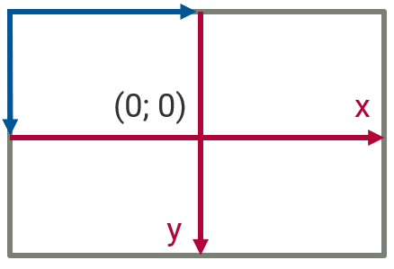
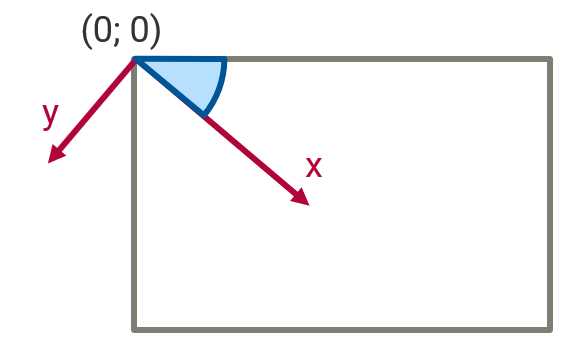
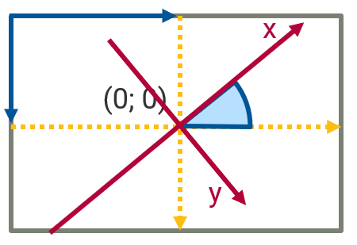
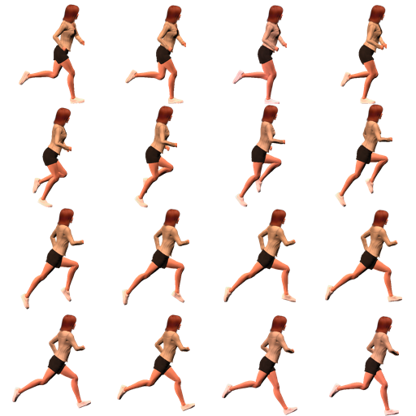
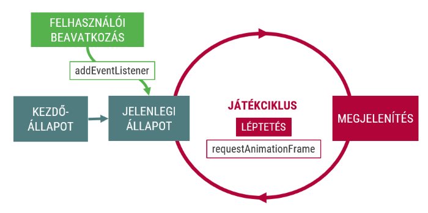

::: title
Webprogramozás
:::

### Canvas, animációk, API-k

:::::: {.columns}
::: {.column width="33%"}
<small>
**Visnovitz Márton**  
egyetemi tanársegéd  
visnovitz.marton@inf.elte.hu
</small>
:::
::: {.column width="33%"}
<small>
**Gerely Viktor**  
demonstrátor  
mohmas@inf.elte.hu
</small>
:::
::: {.column width="33%"}
<small>
**Horváth Győző**  
egyetemi docens  
horvath.gyozo@inf.elte.hu
</small>
:::
::::::

<small>
1117 Budapest, Pázmány Péter sétány 1/c., 2.408  
Tel: (1) 372-2500/8469\
</small>

------

## Ismétlés {data-state="new-section"}

------

## Ismétlés

- JavaScript nyelvi elemei
- DOM programozás
- Eseménykezelés részletei
- Kódszervezés
- Adatok tárolása

------

## Canvas API {data-state="new-section"}

------

## Grafikus lehetőségek a böngészőben

- Képfájlok
- **CSS formázás**
- **(Inline) SVG (vektorgrafika)**
- **Canvas (raszteres grafika)**

------

## Canvas

```html
<canvas ✒>width="200" height="200"<✒></canvas>
```
```js
// Canvas elem elérése
const canvas = document.querySelector('canvas');
// 2D rajzolási "kontextus" elérése
const context = ✒>canvas.getContext('2d')<✒;
```

[Referencia](https://developer.mozilla.org/en-US/docs/Web/HTML/Element/canvas)

------

## Rajzolás a számítógépen


------

## Rajzolás alakzatokkal, képekkel

A `CanvasRenderingContext2D` műveletei:

- Szöveg (`fillText`, `strokeText`)
- Téglalap (`fillRect`, `strokeRect`)
- Kép (`drawImage`)
- Törlés (`clearRect`)

[Referencia](https://developer.mozilla.org/en-US/docs/Web/API/CanvasRenderingContext2D)

---

## Rajzolás útvonalakkal

- Útvonal kezdete (`beginPath`)
- Útvonal lezárása (`closePath`) ❕
- Útvonal kitöltése (`fill`)
- Útvonal megrajzolása (`stroke`)
- Téglalap (`rect`)
- Ellipszis (`ellipse`)
- Körív (`arc`
- "Toll" mozgatása (`moveTo`)
- Vonal (`lineTo`)
- Bezier-görbe (`bezierCurveTo`)

## Beállítások

- Kitöltés színe/mintázata (`fillStyle`)
- Vonal színe (`strokeStyle`)
- Vonal vastagsága (`lineWidth`)
- Vonalak vége (`lineCap`)
- Vonalak illesztése (`lineJoin`)
- Áttetszőség (`globalAlpha`)

------

## Transzformációk

- Forgatás (`rotate`)
- Méretezés (`scale`)
- Eltolás (`translate`)

------

## Eltolás

```js
context.translate(100, 100);
```



------

## Méretezés

```js
context.scale(2, 2);
```


------

## Forgatás

```js
context.rotate(Math.PI / 4);
```



------

### Komplex transzformáció

```js
context.translate(100, 100);
context.rotate(-Math.PI / 4);
// Draw something
context.rotate(Math.PI / 4);
context.translate(-100, -100);
```



------

## Rajzolás útvonalakkal

```js
context.fillRect(5, 5, 20, 100);
context.strokeRect(30, 5, 20, 100);

context.beginPath();
context.rect(110, 5, 20, 100);
context.moveTo(130, 5);
context.lineTo(160, 35);
context.lineTo(130, 65);
context.stroke();

context.beginPath();
context.arc(200, 50, 30, 0, 2 * Math.PI);
context.fill();

context.beginPath();
context.moveTo(5, 200);
context.quadraticCurveTo(55, 100, 105, 200);
context.closePath();
context.stroke();

context.beginPath();
context.moveTo(105, 200);
context.bezierCurveTo(105, 130, 200, 150, 200, 90);
context.lineTo(190, 90);
context.lineTo(200, 80);
context.lineTo(210, 90);
context.lineTo(200, 90);
context.stroke();
```

<div class="example">
  <iframe 
    src="examples/01-drawing.html"
    style="width:520px; height: 120px"
  ></iframe>
</div>

------

## Animációk {data-state="new-section"}

------

Alapelv: a vásznon lévő kép **gyors** újrarajzolása

1. Változások újrarajzolása
2. Teljes kép újrarajzolása

Alkalmazás-modell:

1. Állapot (adatok)
2. Nézet (rajzolás)

------

## Példa

<div class="example">
  <iframe 
    src="examples/02-animation.html"
    style="width:520px; height: 520px"
  ></iframe>
</div>

------

## Animációs ciklus


------

## Animációs ciklus

```js
const state = /*...*/;

function next() {
  update(); // Update current state
  render(); // Rerender the frame
  requestAnimationFrame(next);
}

next(); // Start the loop

function update() { /*...*/ }
function render() { /*...*/ }
```

## Idő alapú animáció

Az állapot változása az eltelt idő függvénye (pl. fizika)

```js
let lastFrameTime = performance.now();
const state = /*...*/;

function next() {
  ✒>const currentTime = performance.now();<✒
  ✒>const dt = currentTime - lastFrameTime;<✒

  update(✒>dt<✒); // Update current state
  render(); // Rerender the frame

  ✒>lastFrameTime = currentTime;<✒

  requestAnimationFrame(next);
}

next(); // Start the loop
```

------

## Egységbe zárás

```js
class Actor {
  constructor() {
    /* Initialize */
  }

  update(dt) {
    /* Update properties */
  }

  draw(context) {
    /* Render to canvas */
  }
}
```

------

## Példa

```js
class Ball {
  vx = 500;
  radius = 20;

  constructor(x = this.radius) {
    this.x = x;
  }

  update(dt) {
    this.x += this.vx * dt / 1000;
  }

  render(context) {
    context.beginPath();
    context.arc(this.x, this.radius, this.radius, 0, Math.PI * 2);
    context.fill();
  }

  bounceBack() {
    this.vx *= -1;
  }
}
```

<div class="example">
  <iframe
    src="examples/03-class.html"
    style="width: 500px; height: 70px"
  ></iframe>
</div>

------

## Spritesheetek használata



------

## Spritesheetek használata

```js
const spritesPerRow = 4;
const spritesCount = 16;
const spriteDuration = 16;
const spriteWidth = 128;
const spriteHeight = 128;

let lastFrameTime = performance.now();

const spriteSheet = new Image();
spriteSheet.src = "spritesheet.png";

const state = {
  currentSprite: 0,
  timeSinceSpriteChange: 0
};

function next() {
  const currentTime = performance.now();
  const dt = currentTime - lastFrameTime;

  update(dt);
  render();

  lastFrameTime = currentTime;

  requestAnimationFrame(next);
}

function update(dt) {
  state.timeSinceSpriteChange += dt;
  if (state.timeSinceSpriteChange > spriteDuration) {
    const newSprite = (state.currentSprite + 1) % spritesCount;
    state.currentSprite = newSprite;
    state.timeSinceSpriteChange = 0;
  }
}

function render() {
  context.clearRect(0, 0, canvas.width, canvas.height);
  const spriteX = state.currentSprite % spritesPerRow;
  const spriteY = Math.trunc(state.currentSprite / spritesPerRow);
  context.drawImage(
    spriteSheet, 
    spriteWidth * spriteX,  // Source X
    spriteHeight * spriteY, // Source Y
    spriteWidth,            // Source width
    spriteHeight,           // Source height
    0,                      // Target X
    0,                      // Target Y
    spriteWidth,            // Target width
    spriteHeight,           // Target height
  );
}

next();
```

<div class="example">
  <iframe
    src="examples/04-spritesheet.html"
    style="width: 138px; height: 138px"
  ></iframe>
</div>

------

## Sprite osztály

```js
class Sprite {
  currentFrame = 0;
  timeSinceLastFrame = 0;

  constructor({
    image, 
    width, 
    height, 
    spritesPerRow, 
    rowCount, 
    frameDuration = 30
  }) {
    this.image = new Image();
    this.image.src = image;
    this.width = width;
    this.height = height;
    this.spritesPerRow = spritesPerRow;
    this.rowCount = rowCount;
    this.frameDuration = frameDuration;
  }

  get spriteCount() {
    return this.spritesPerRow * this.rowCount;
  }

  update(dt) {
    this.timeSinceLastFrame += dt;

    if (this.timeSinceLastFrame > this.frameDuration) {
      const newFrame = (this.currentFrame + 1) % this.spriteCount;
      this.currentFrame = newFrame;
      this.timeSinceLastFrame = 0;
    }
  }

  render(context, targetX, targetY, width, height) {
    const sourceX = 
      (this.currentFrame % this.spritesPerRow) * 
      this.width;
    const sourceY = 
      Math.trunc(this.currentFrame / this.spritesPerRow) * 
      this.height;

    context.drawImage(
      this.image,
      sourceX, sourceY, this.width, this.height, 
      targetX, targetY, width || this.width, height || this.height
    );
  }
}
```

------

## Animáció Sprite osztállyal

```js
const sprite = new Sprite({
  image: "spritesheet.png",
  width: 128, 
  height: 128,
  spritesPerRow: 4,
  rowCount: 4,
  frameDuration: 30
});

let lastFrameTime = performance.now();

function next() {
  const currentTime = performance.now();
  const dt = currentTime - lastFrameTime;

  context.clearRect(0, 0, canvas.width, canvas.height);

  ✒>sprite.update(dt);<✒
  ✒>sprite.render(context, 0, 0);<✒

  lastFrameTime = currentTime;

  requestAnimationFrame(next);
}

next();
```

<div class="example">
  <iframe 
    src="examples/05-sprite.html"
    style="width: 138px; height: 138px"
  ></iframe>
</div>

------

## Sprite kiterjesztése

```js
class Runner extends Sprite {
  direction = 1;
  x = 0;
  vx = 200;

  update(dt) {
    super.update(dt);
    ✒>this.x += this.vx * dt / 1000;<✒
  }

  render(context) {
    ✒>context.save();
    context.translate(this.x, 0);
    context.scale(this.direction, 1);
    super.render(context, -this.width, 0);
    context.restore();<✒
  }

  turnAround() {
    this.vx *= -1;
    this.direction *= -1;
  }
}
```

------

## Sprite mozgatása

```js
const runner = new Runner({/*...*/});
let lastFrameTime = performance.now();
function next() {/*...*/}

function update(dt) {
  ✒>runner.update(dt);

  if (runner.x >= canvas.width || runner.x <= 0) {
    runner.turnAround();
  }<✒
}

function render() {
  ✒>runner.render(context);<✒
}
```

<div class="example">
  <iframe
    src="examples/06-movement.html"
    style="width: 720px; height: 138px"
  ></iframe>
</div>

------

## Háttérgrafika

<div class="example">
  <iframe
    src="examples/07-background.html"
    style="width: 300px; height: 300px"
  ></iframe>
</div>

------

## Játékok készítése = Interaktív animáció

Globális eseménykezelők módosítják az animáció paramétereit



[Játék példa](https://swarmed.herokuapp.com)

------

## 3D grafika

A Canvas elemre: WebGL technológiával

```js
const canvas = document.querySelector("canvas");
const webGl = cavnas.getContext("webgl");
webGl.viewport(0, 0, canvas.width, canvas.height);
```

------

## Demo

<iframe
  src="http://webglsamples.org/aquarium/aquarium.html" 
  style="width: 700px; height: 500px"
></iframe>

[Példák](https://github.com/WebGLSamples/WebGLSamples.github.io)

------

## API-k a böngészőben {data-state="new-section"}

------

## API-k a böngészőben

Programozási interfészek erőforrások eléréséhez/kezeléséhez

- BOM (Browser Object Model)
- Location API
- Geolocation API
- MediaDevices API
- File API
- ...

------

## BOM (`window`)

- A böngésző irányítása a `window` objektumon keresztül
- `window.innerWidth`, `window.innerHeight`, ...
- `window.open()`, `window.close()`, ...

```js
const options = "resizable,width=800,height=600,scrollbars=yes";
const elte = window.open("http://www.elte.hu", "ELTE", options);
elte.resizeTo(400, 200);
elte.document.querySelector("p");
elte.opener; // window
elte.close();
```

<div class="example">
  <button id="newWindow">Open new window</button>
</div>

<script>
  const button = document.querySelector("#newWindow");
  button.addEventListener("click", function () {
    const options = "resizable,width=800,height=600,scrollbars=yes";
    const newWindow = window.open("http://www.elte.hu", "ELTE", options);
  });
</script>

[Referencia](https://developer.mozilla.org/en-US/docs/Web/API/Window)

------

## Location API

- A címsor tartalmának olvasása
- Az egyes részek külön kezelhezők
- `hash`, `host`, `hostname`, `href`, `origin`, `pathname`, `port`, `protocol`, `search`, `username`, `password`

```js
// http://example.com:8080/page.html?name=value#anchor
location.href;      // az egész URL
location.host;      // "example.com:8080"
location.hostname;  // "example.com"
location.origin;    // "http://example.com:8080"
location.pathname;  // "/page.html"
location.port;      // "8080"
location.protocol;  // "http:"
location.search;    // "?name=value"
location.hash;      // "#anchor"
```

------

## Location API

- URL módosítása
  - `assign(newUrl)`: új oldal betöltése
  - `replace(newUrl)`: jelenlegi felülírása
  - `reload()`: újratöltés
- Események
  - `hashchange`: az URL fragment megváltozása

```js
window.location = "http://www.elte.hu";
window.location.href = "http://www.elte.hu";
window.location.assign("http://www.elte.hu");
window.location.replace("http://www.elte.hu");
window.location.reload();
```

------

## `URLSearchParams`

A `location.search` paraméter feldolgozására

```js
const searchParams = new URLSearchParams(location.search);

searchParams.has("paramName");
searchParams.get("paramName");
searchParams.getAll("paramName");
searchParams.set("paramName");
searchParams.append("paramName", "paramValue");
searchParams.delete("paramName");
```

[Referencia](https://developer.mozilla.org/en-US/docs/Web/API/Location)

------

## History API

Közlekedés az előzményekben

- `window.history`
    + `back()`
    + `forward()`
    + `go(n)`

```js
window.history.back();
window.history.forward();
window.history.go(-3);
```

------

## History API

Módosítás

- `window.history.pushState(stateObj, name, url)`
- `window.history.replaceState(stateObj, name, url)`
- `window.onpopstate` esemény

```js
window.onpopstate = function(event) {
  console.log(JSON.stringify(event.state));
};

history.pushState({ page: 1 }, "title 1", "?page=1");
history.pushState({ page: 2 }, "title 2", "?page=2");
history.replaceState({ page: 3 }, "title 3", "?page=3");
history.back(); // logs "location: http://example.com/example.html?page=1, state: {"page":1}"
history.back(); // logs "location: http://example.com/example.html, state: null"
history.go(2);  // logs "location: http://example.com/example.html?page=3, state: {"page":3}"
```

------

## LocalStorage API

- Adatok tárolása helyi gépen
- Kulcs-érték párok gyűjteménye
- Csak egyszerű értékek tárolhatók ➡ szerializáció

```js
// Storing values
localStorage.setItem("foo") = 42;
// or
localStorage.bar = 42;

// Reading values
console.log(localStorage.getItem("foo"));
// or
console.log(localStorage.bar);

// Storing complex data
const data = [1, 3, 5, 7];
localStorage.setItem('data', JSON.stringify(data));
const loadedData = JSON.parse(localStorage.getItem('data'));
```

------

## Médiaelemek vezérlése {data-state="new-section"}

------

## Audio

- Hangállományok lejátszása
- [`HTMLAudioElement`](https://developer.mozilla.org/en-US/docs/Web/API/HTMLAudioElement) 

```html
<audio src="horn.wav" id="audio1" controls></audio>
```
```js
// meglévő elem
document.querySelector('audio').play();

// in-memory elem
const audio = document.createElement('audio');
audio.src = 'horn.wav';
audio.play();
```

<div class="example">
  <iframe
    src="examples/08-audio.html"
    style="width: 500px; height: 70px;"
  ></iframe>
</div>

--------------------------

## Video

- HTML `<video>` tag
- [`HTMLVideoElement`](https://developer.mozilla.org/en-US/docs/Web/API/HTMLVideoElement)

<div class="example">
  <iframe
    src="examples/09-video.html"
    style="width: 500px; height: 300px;"
  ></iframe>
</div>

------

## Összefoglalás

- Rajzolás a `canvas` elemre
- Animációk, játékok a `canvas` elemmel
- JavaScript API-k
- Médiaelemek vezérlése