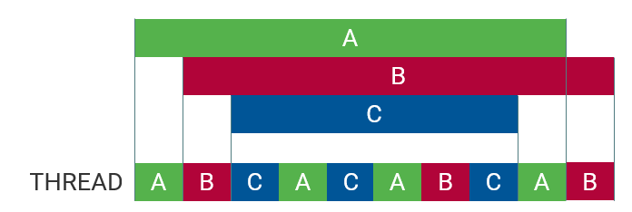
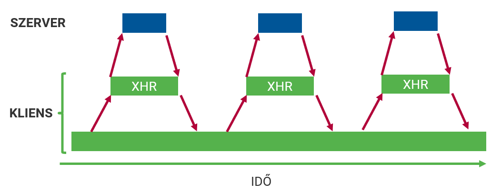

::: title
Webprogramozás
:::

### Aszinkron programozás, AJAX, hibakezelés

:::::: {.columns}
::: {.column width="33%"}
<small>
**Visnovitz Márton**  
egyetemi tanársegéd  
visnovitz.marton@inf.elte.hu
</small>
:::
::: {.column width="33%"}
<small>
**Horváth Győző**  
egyetemi docens  
horvath.gyozo@inf.elte.hu
</small>
:::
::::::

<small>
1117 Budapest, Pázmány Péter sétány 1/c., 2.408  
Tel: (1) 372-2500/8469\
</small>

------

## Ismétlés {data-state="new-section"}

------

## Ismétlés

- [x] JavaScript nyelvi elemei
- [x] DOM programozás
- [x] Eseménykezelés részletei
- [x] Kódszervezés, adatok tárolása
- [x] Canvas, animációk, API-k

------

## JSON {data-state="new-section"}

------

## JSON

- [JavaScript Object Notation](http://json.org/)
- Adatleíró formátum
- A JavaScript literálformáira épül
- Központ eleme
  + objektum: `{}`
  + tömb: `[]`
- Elterjedt és népszerű
- `JSON.stringify()`
- `JSON.parse()`

------

## JSON - Példa

```js
{
  "Title": "The Hobbit: An Unexpected Journey",
  "Year": "2012",
  "Rated": "PG-13",
  "Released": "14 Dec 2012",
  "Runtime": "169 min",
  "Genre": "Adventure, Fantasy",
  "Director": "Peter Jackson",
  "Language": "English",
  "Country": "USA, New Zealand",
  "Poster": "https://m.media-amazon.com/images/<...>",
  "Ratings": [
    {
      "Source": "Internet Movie Database",
      "Value": "7.8/10"
    },
    {
      "Source": "Rotten Tomatoes",
      "Value": "64%"
    },
    {
      "Source": "Metacritic",
      "Value": "58/100"
    }
  ],
  "Metascore": "58",
  "imdbRating": "7.8",
  "imdbVotes": "725,598",
  "imdbID": "tt0903624",
  "Type": "movie",
  "DVD": "19 Mar 2013",
  "BoxOffice": "$303,001,229",
  "Production": "Warner Bros.",
  "Website": "N/A",
  "Response": "True"
}
```

------

## JSON sorosítás oda-vissza

```js
const data = {
  foo: "string",
  bar: [1, 2, 3]
}

// Serialization
const serializedData = JSON.stringify(data);
console.log(serializedData);
// '{"foo":"string","bar":[1,2,3]}'

// Deserialization
const deserializedData = JSON.parse(serializedData);
console.log(deserializedData);
// Object { foo: "string", bar: Array[3] }
```

------

## Szinkron vs aszinkron programozás {data-state="new-section"}

------

## Szinkron műveletek

- Szinkron ~ szinkronizált ~ összekapcsolt ~ függő
- **Szinkron művelet**: meg kell várni a végét, mielőtt a következőre ugranánk
- Az egyik művelet eleje függ a másik végétől
- Szekvencia


------

## Szinkron példa

```js
console.log('first');
alert('second');
console.log('third');
```

<div class="example">
  <button id="sync-example">Alert</button>
</div>

<script>
document.querySelector("#sync-example").addEventListener("click", function () {
  console.log('first');
  alert('second');
  console.log('third');
});
</script>

------

## Szinkron végrehajtás


------

## {data-background-iframe="http://latentflip.com/loupe/?code=ZnVuY3Rpb24gYSgpIHsKICAgIGNvbnNvbGUubG9nKCdhJykKfQpmdW5jdGlvbiBiKCkgewogICAgY29uc29sZS5sb2coJ2InKQogICAgYygpCn0KZnVuY3Rpb24gYygpIHsKICAgIGNvbnNvbGUubG9nKCdjJykKfQphKCkKYigp!!!" data-background-interactive="true"}

------

## Szinkron hátránya

- **Hosszú műveletek** megvárása
  + időzítők
  + hálózati műveletek
  + lemezkezelés

------

## Aszinkron

- Másik feladat elindítható az egyik vége előtt
- Nem függnek egymástól



------

## Szinkron vs aszinkron


------

## Példa: Szinkron vs aszinkron

**Szinkron**  
*Mozijegyért állsz sorba. Addig nem tudod megvenni, amíg az előtted lévők nem vették meg, és ugyanez igaz a mögötted állókra is.*

**Aszinkron**  
*Étteremben vagy sok más emberrel együtt. Megrendeled az ételedet. Mások is rendelhetnek ételt, nem kell megvárniuk, míg a tiédet elkészítik és felszolgálják. A konyhában a dolgozók folyamatosan főznek, szolgálnak fel és rendeléseket fogadnak. Az emberek akkor fogják az ételüket megkapni, amikor az elkészült.*

------

## Példák aszinkron működésre

```js
// Timer
console.log("first");

setTimeout(function () {
  console.log("second");
}, 1000);

console.log("third");
```

```js
// Event handler
console.log("first");

button.addEventListener("click", function () {
  console.log("second");
});

console.log('third');
```

------

## Event loop

Konkurrencia egy szálon


------

## {data-background-color="white" data-background-iframe="http://latentflip.com/loupe/?code=JC5vbignYnV0dG9uJywgJ2NsaWNrJywgZnVuY3Rpb24gb25DbGljaygpIHsKICAgIHNldFRpbWVvdXQoZnVuY3Rpb24gdGltZXIoKSB7CiAgICAgICAgY29uc29sZS5sb2coJ1lvdSBjbGlja2VkIHRoZSBidXR0b24hJyk7ICAgIAogICAgfSwgMjAwMCk7Cn0pOwoKY29uc29sZS5sb2coIkhpISIpOwoKc2V0VGltZW91dChmdW5jdGlvbiB0aW1lb3V0KCkgewogICAgY29uc29sZS5sb2coIkNsaWNrIHRoZSBidXR0b24hIik7Cn0sIDUwMDApOwoKY29uc29sZS5sb2coIldlbGNvbWUgdG8gbG91cGUuIik7!!!PGJ1dHRvbj5DbGljayBtZSE8L2J1dHRvbj4%3D" data-background-interactive="true"}

------

## Callback függvény

- Paraméterként átadott függvény meghívása
- Ő maga nem szinkron/aszinkron
- **Az API szinkron/aszinkron**

:::::::::::::::::::: {.columns}
::: {.column style="width: 50%"}
```js
// Syncronous
function a(b) {
    b();  // callback
}

console.log("first");
a(function () {
  console.log("second");
});
console.log("third");

// OR

[1, 3, 5].map(e => e * 2);
```
:::

::: {.column style="width: 50%"}
```js
// Asyncronous
console.log("first");

setTimeout(function () {
  console.log("second");
}, 1000);

console.log("third");
```
:::
::::::::::::::::::::

------

## Probléma: Callback hell

```js
setTimeout(() => {
  console.log("first");
  setTimeout(() => {
    console.log("second");
    setTimeout(() => {
      console.log("third");
      setTimeout(() => {
        console.log("fourth");
      },1000);
    }, 1000);
  }, 1000);
}, 1000);
```

------

## Megoldás: Promise

- **Aszinkron művelet jövőbeli értékét reprezentáló objektum**
- Állapota: `pending`, `fulfilled`, `rejected`
- Metódosuok: `.then()`, `.catch()`

```js
function delay(ms) {
  return ✒>new Promise(function (resolve, reject) {
    setTimeout(() => {
      console.log(`${ms} timeout`);
      resolve(ms);
    }, ms);
  });<✒
}

// USAGE

delay(1000).then(ms => console.log("Result", ms));
```

------

## Promise lánc

```js
delay(1000)
  .then((ms) => { return delay(500);          })
  .then((ms) => { return delay(2000);         })
  .then((ms) => { return 800;                 })
  .then((ms) => { console.log("Finally", ms); })
  .catch(() => {
    console.log("There are some errors");
  });
```

------

## Async - Await

- ES8 (2017) óta része a szabványnak
- **Promise**-okkal dolgozik

```js
✒>async<✒ function lotOfDelays() {
  try {
    ✒>await<✒ delay(500);
    ✒>await<✒ delay(2000);
    ✒>const ms = await<✒ delay(800);
    console.log("Finally", ms);
  } catch {
    console.log("There are some errors")
  }
}

lotOfDelays();
```

------

## Web workers

- Valódi többszálúság JavaScriptben
- Kommunikáció szálak között: üzenetek/események

```js
// Main thread
const worker = new Worker("worker.js");

worker.onmessage = function(e) {
  console.log(e.data);
};

worker.postMessage("some data");
```
```js
// worker.js
self.onmessage = function(e) {
  self.postMessage("Recieved data: " + e.data);
};
```

------

## AJAX és Fetch {data-state="new-section"}

------

## Hagyományos oldalak


------

## AJAX-os oldalak



------

## AJAX

- **Asynchronous JavaScript and XML**
- A kapcsolatfelvétel a szerverrel szükséges
- Csak a szükséges adatok továbbítása a **háttérben**
- A teljes oldal újratöltése nélkül

------

## AJAX-os oldal tulajdonságai

- A felhasználói felület folyamatosan használható
- Nincs szaggatottság, villogás, ugrálás
- A szerverrel való kommunikáció a háttérben történik
- Aszinkron módon, azaz párhuzamosan a többi eseménnyel
- Csak a szükséges adatok közlekednek a szerver és kliens között

------

## AJAX hívás eszközei

- API
  + [`XMLHttpRequest` objektum](https://developer.mozilla.org/en-US/docs/Web/API/XMLHttpRequest) és [használata](https://developer.mozilla.org/en-US/docs/Web/API/XMLHttpRequest/Using_XMLHttpRequest)
  + [`fetch`](https://developer.mozilla.org/en-US/docs/Web/API/Fetch_API) és [használata](https://developer.mozilla.org/en-US/docs/Web/API/Fetch_API/Using_Fetch)
- Fejlesztői eszköztár
  + Hálózat fül

------

## Példa

`http://www.omdbapi.com/?t=the+shack&apikey=<key>`

<div class="example">
  <input type="text" value="Star Wars" id="ajax-title">
  <button id="ajax-search">Search</button>
  <span id="progress">Not started</span>
  <br>
  <output id="ajax-image"></output>
</div>

<script>
  const progress = document.querySelector("#progress");
  document.querySelector("#ajax-search").addEventListener("click", function () {
      const title = document.querySelector("#ajax-title").value;
      const xhr = new XMLHttpRequest();
      xhr.addEventListener("load", responseHandler);
      xhr.addEventListener("progress", progressHandler);
      xhr.open("GET", `http://www.omdbapi.com/?t=${title}&apikey=2dd0dbee`);
      xhr.responseType = "json";
      xhr.send(null);
  });

  function responseHandler(e) {
      document.querySelector("#ajax-image").innerHTML = `
        
      `;
      progress.innerHTML = `Complete`;
  }

  function progressHandler(e) {
      if (e.lengthComputable) {
          progress.innerHTML = `${e.loaded / e.total * 100}%`;
      }
  }
</script>

------

## Szinkron megoldás

```js
const input = document.querySelector("input");
const button = document.querySelector("button");
const img = document.querySelector("img");

button.addEventListener("click", function () {
  const title = input.value;

  ✒>const xhr = new XMLHttpRequest();<✒

  xhr.open("GET", `http://www.omdbapi.com/?t=${title}&apikey=<key>`, false);
  xhr.send(null);

  const response = JSON.parse(xhr.responseText)
  img.src = response.Poster;
});
```

------

## Aszinkron megoldás

`load`, `loadend`, `abort`, `error`, `timeout` események

```js
function getPoster() {
  const title = input.value;
  const xhr = new XMLHttpRequest();

  ✒>xhr.addEventListener("load", responseHandler);<✒
  xhr.open("GET", `http://www.omdbapi.com/?t=${title}&apikey=<key>`);
  xhr.send(null);
}

function responseHandler() {
  const response = JSON.parse(this.responseText)
  img.src = response.Poster;
}
```

------

## Választípus

`responseType`, `response`

```js
function getPoster() {
  const title = input.value;
  const xhr = new XMLHttpRequest();

  xhr.addEventListener("load", responseHandler)
  xhr.open("GET", `http://www.omdbapi.com/?t=${title}&apikey=<key>`)
  ✒>xhr.responseType = "json";<✒
  xhr.send(null);
}

function responseHandler() {
  img.src = this.response.Poster;
}
```

------

## Hibakezelés

```js
function getPoster() {
  const title = input.value;
  const xhr = new XMLHttpRequest();

  xhr.addEventListener("load", responseHandler);
  ✒>xhr.addEventListener("error", errorHandler);<✒
  xhr.open("GET", `http://www.omdbapi.com/?t=${title}&apikey=<key>`);

  xhr.responseType = "json";
  xhr.send(null);
}

function errorHandler() {
  console.error("Error");
}

function responseHandler() {
  img.src = this.response.Poster;
}
```

------

## Folyamat

`progress` esemény

```js
const progress = document.querySelector("progress");

function getPoster() {
  const title = document.querySelector("input").value;
  const xhr = new XMLHttpRequest();

  xhr.addEventListener("load", responseHandler);
  ✒>xhr.addEventListener("progress", progressHandler);<✒
  xhr.open("GET", `http://www.omdbapi.com/?t=${title}&apikey=<key>`);
  
  xhr.responseType = "json";
  xhr.send(null);
}

✒>function progressHandler(e) {
  if (e.lengthComputable) {
    progress.max = e.total;
    progress.value = e.loaded;
  }
}<✒

function responseHandler(e) {
  document.querySelector("img").src = this.response.Poster;
  progress.value = e.loaded;
}
```

------

## fetch API

Promise-okkal

```js
function getPoster() {
  const title = document.querySelector("input").value;

  ✒>fetch<✒(`http://www.omdbapi.com/?t=${title}&apikey=2dd0dbee`)
    ✒>.then<✒(response => response.json())
    ✒>.then<✒(response => {
      document.querySelector("img").src = response.Poster;
    });
}

// OR

✒>async<✒ function getPoster() {
  const title = document.querySelector("input").value;
  const response = ✒>await<✒ fetch(`http://www.omdbapi.com/?t=${title}&apikey=2dd0dbee`);
  const json = ✒>await<✒ response.json();
  document.querySelector("img").src = json.Poster;
}
```

------

## Kivételkezelés  {data-state="new-section"}

------

## Hibák JavaScriptben

:::::::::::::::::::: {.columns}
::: {.column}
- `Error`
  + `EvalError`
  + `RangeError`
  + `ReferenceError`
  + `SyntaxError`
  + `TypeError`
  + `URIError`
:::

::: {.column}
- Tulajdonságok
  + `name`
  + `message`
:::
::::::::::::::::::::

------

## Hibakezelés

- try-catch-finally
  + `try`: védendő kód
  + `catch`: hibakezelő kód
  + `finally`: a végén lefutó kód (nem kötelező)

```js
try {
  foo.bar = true;
} catch (e) {
  console.log(e.name);    // ReferenceError
  console.log(e.message); // foo is not defined
} finally {  // Optional
  console.log("Finally...");
}
```

------

## Hiba dobása

Beépített hiba dobása

```js
if (typeof a !== "number") {
  throw new Error("Argument is not a number!");
}
```

------

## Hiba dobása

Saját hibaobjektum dobása

```js
if (oszto == 0) {
  throw {
    name: "DivisionByZeroError",
    message: "Division by zero!"
  };
}
```

vagy

```js
class DivisionByZeroError extends Error() {}

if (divisor == 0) {
  throw new DivisionByZeroError("Division by zero!");
}
```

------

## Összefoglalás

- [x] Szinkron és aszinkron műveletek
- [x] Promiseok
- [x] Async-await
- [x] AJAX / Fetch
- [x] Kivételkezelés
